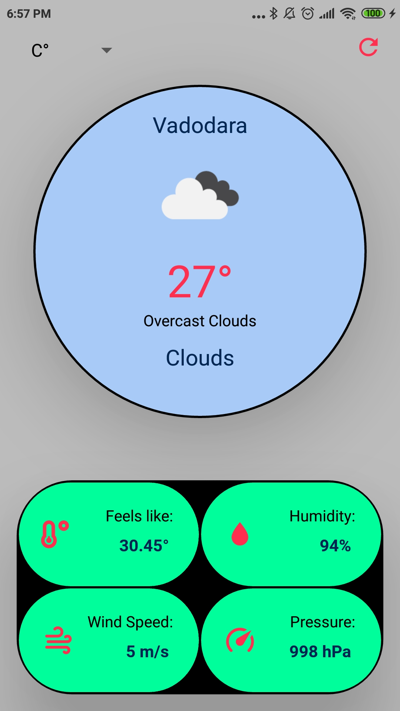
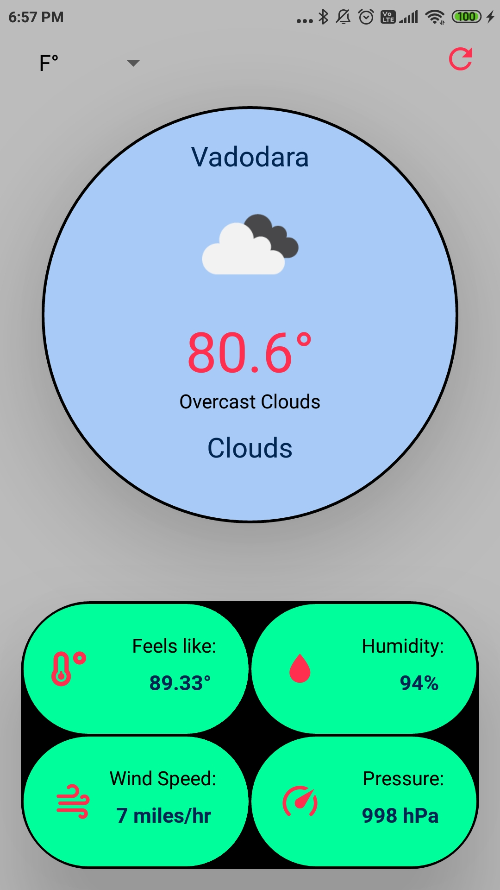

# Weather-App-using-REACT-NATIVE
This is a simple Weather App using REACT-NATIVE. This app has very basic requirements that all weather app have. You are able to see the current weather conditions of your location such as temperature, humididty, wind speed and pressure.
I have used [REACT-NATIVE PICKER SELECT](https://reactnative.dev/docs/picker) to select Celius scale or fahrenheit scale. I have used *Font Awesome5*, *Material Community Icons* and *ionicons* from [Expo's Vector-Icons](https://docs.expo.io/guides/icons/). These icons will change according to the weather of your location. For acquiring weather details, I have used API from [Open-Weather](https://openweathermap.org/api).

## How to Use it ?
Get this repository to your laptop/pc: 
```
git clone https://github.com/charmilgandhi/Weather-App-using-REACT-NATIVE.git
```
Node and NPM version as follows: 
| Node | NPM |
| ---- |-----|
| 12.28.2| 6.14.5| 

Install [Expo cli](https://docs.expo.io/workflow/expo-cli/) using npm. You can also use Yarn.
```
npm install -g expo-cli
```
If you are an Andoid user, you can find expo client app on playstore. Run: 
```
npm start
```
OR
```
expo start
```
You will find a QR code. Scan it with expo client app on phone. You can also use an Android Emulator on laptop/pc or run the app in browser.
To get the weather condition of your location, you need an API key. Go to [Open-Weather](https://openweathermap.org/api) and Sign In. After signing in, go to API Keys section where you will find your API key. Copy it and paste it in respective place in code.

### Bam..!!! Ready To GO..!!!
## Celcius Scale


## Fahrenheit Scale



